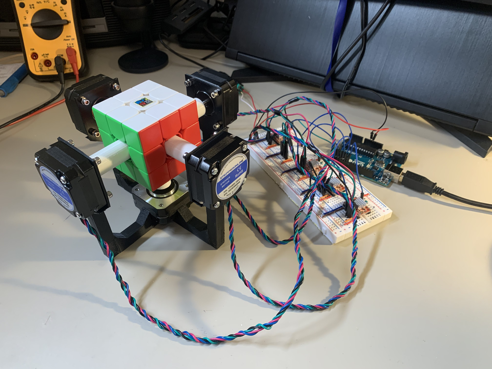
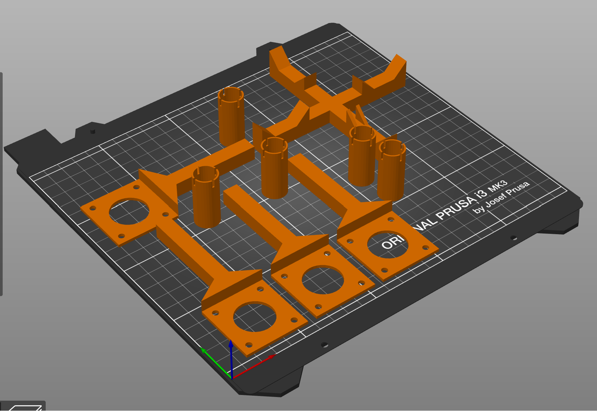
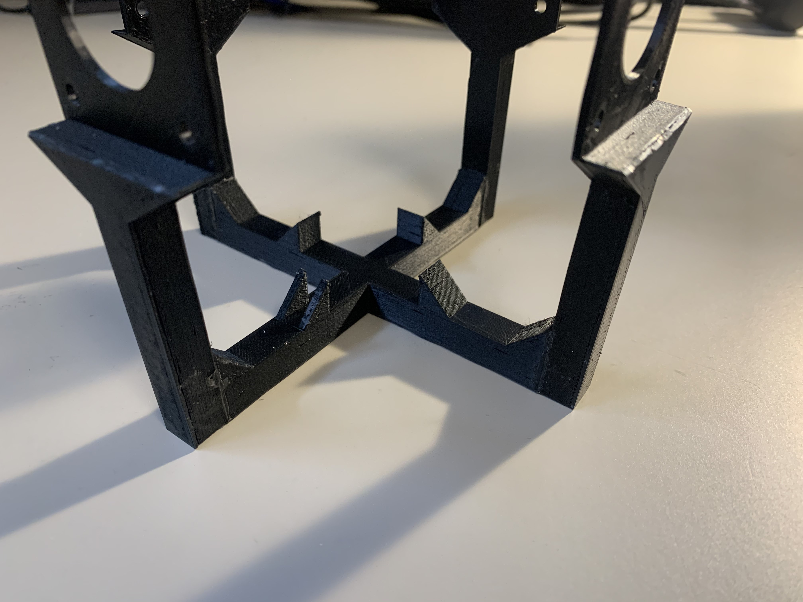
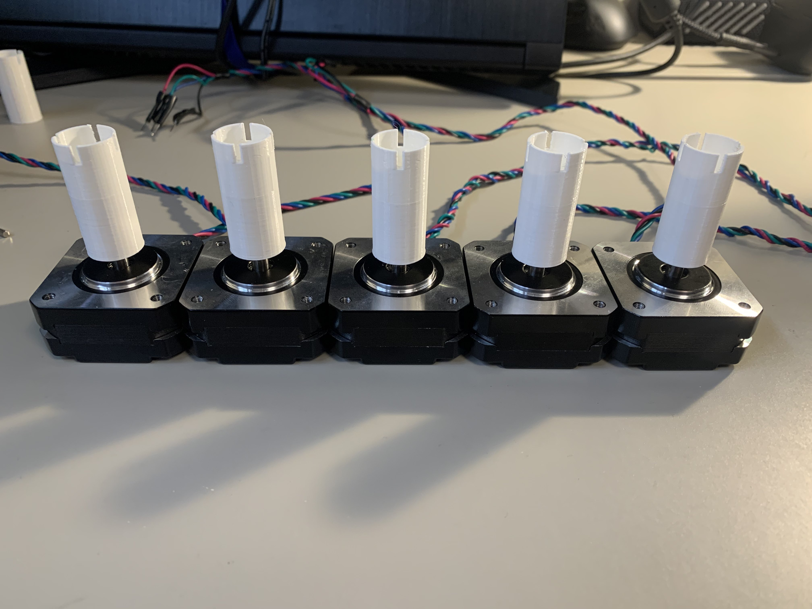
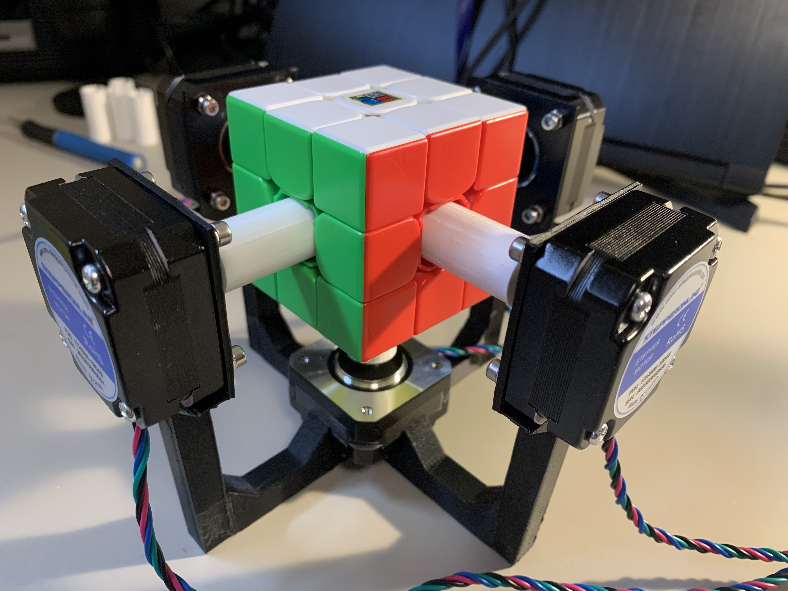
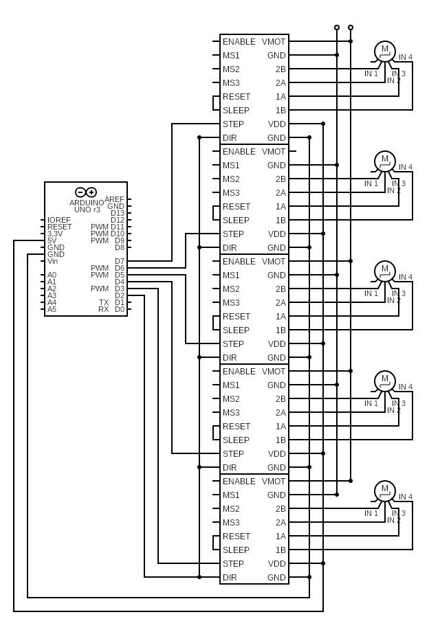

# Cube Bot

Arduino controlled Rubik's cube robot.

## Core Features

- 🎲 **Scramble** cube
- 📜 Run **algorithms**
- 🤖 **Solve** cube

## Overview

Cube Bot is a Rubik's cube robot built using an Arduino. It uses 5 stepper motors to control 5 of the 6 sides of the cube. Even though there isn't a way to directly rotate the final side of the cube, there are sequences of moves that can rotate all the pieces around the center without actually turning that side. In fact, a robot consisting of just 4 motors is still possible.

## Parts list (~$100 USD)

\* _Note: access to a 3d printer is required_

- [Arduino UNO](https://www.amazon.com/dp/B008GRTSV6/)
- [Motor Power Supply (12V 1A)](https://www.amazon.com/gp/product/B07VQHYGRD/)
- [5x NEMA 17 Stepper Motor (22mm)](https://www.amazon.com/gp/product/B00PNEQ79Q/)
- [A4988 Stepper Motor Driver](https://www.amazon.com/gp/product/B07BND65C8/)

### Other useful items (~$40 USD)

- [Breadboards](https://www.amazon.com/dp/B07DL13RZH/)
- [Breadboard Crimps](https://www.amazon.com/gp/product/B0146DJR9Q/)
- [Breadboard Jumpers](https://www.amazon.com/dp/B005TZJ0AM/)
- [M3 Screw Kit](https://www.amazon.com/dp/B0BMQFHDBH/)

## Printing

All 10 pieces can easily fit on a single print bed.

- [1x Base](src/base.stl)
- [4x Side](src/side.stl)
- [5x Center](src/center.stl)

## Assembly

1. Glue the frame sides to the base

2. Press the centers onto the motor shafts

3. Attach motors to frame using m3 screws

**IMPORTANT:** Assemble with cube in place! You may not be able to insert the cube with the motors attached.

## Wiring

TODO

